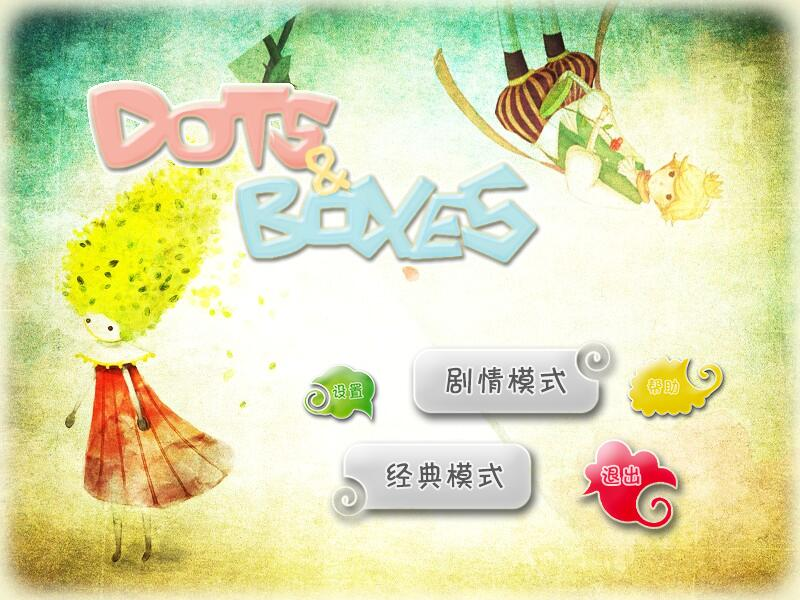
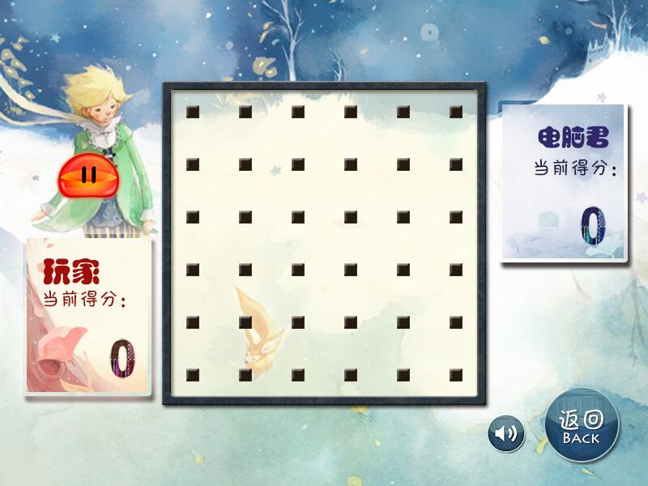
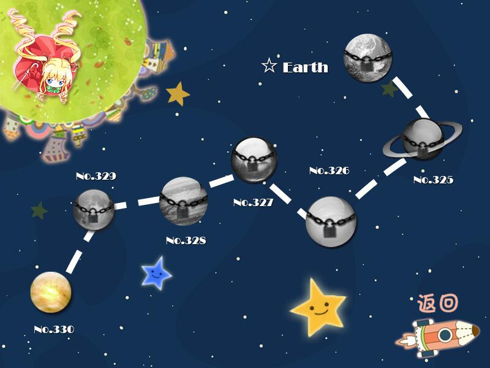
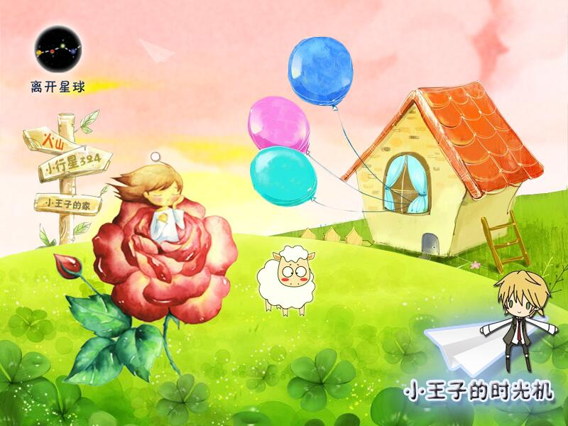
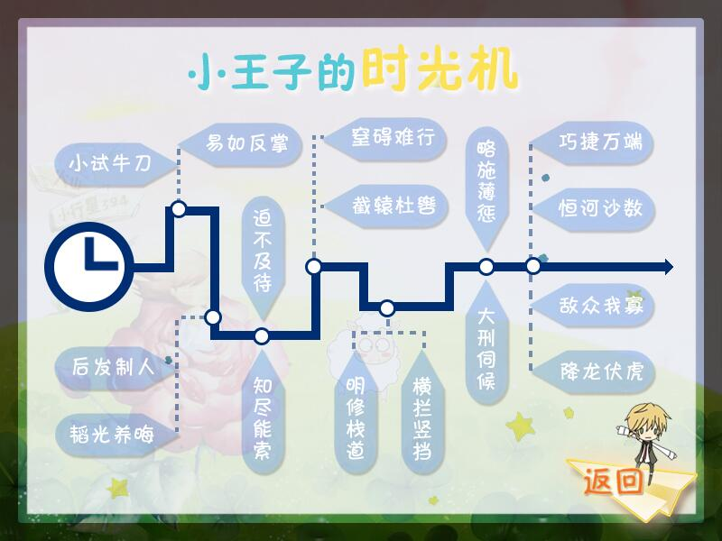
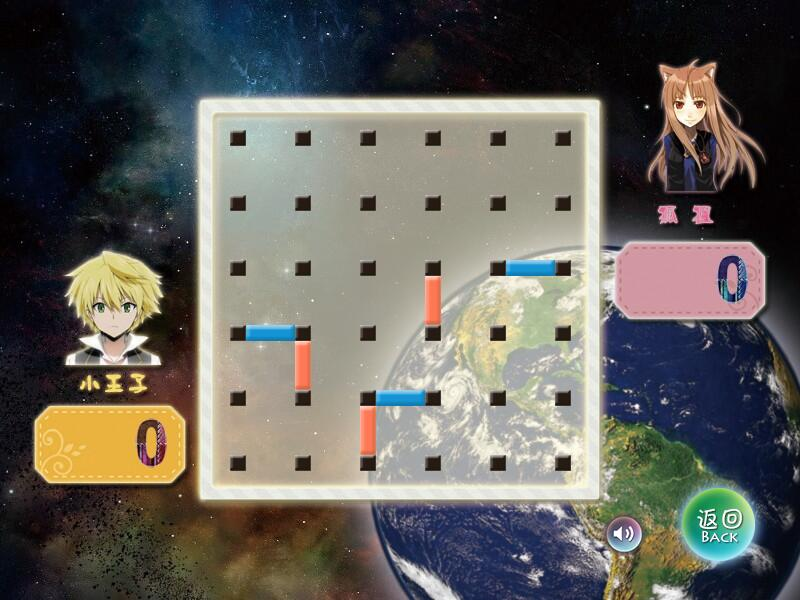

# DotsAndBoxes
Dots And Boxes —— 点点连格智力游戏

开发团队：Deworm

团队成员：

- [tomato990(对座)](https://github.com/tomato990)
- [vboar](https://github.com/vboar)
- [JaneLdq](https://github.com/JaneLdq)
- [oneoneO1](https://github.com/oneoneO1)

IDE：Eclipse

注：本项目中所使用到的音频和图片资源均来源于互联网，如有侵权请告知我们，我们马上移除。

游戏部分截图：

